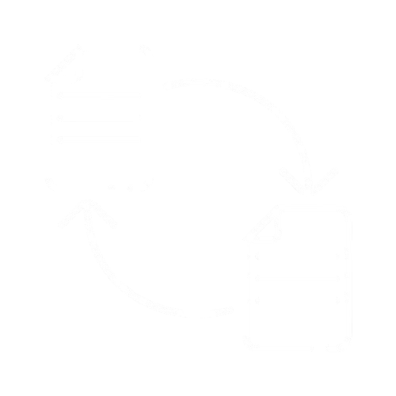

<div align="center">
    <h1>
        
    </h1>
    <p>
        A P2P file transfer tool using Django Channels.<br>
        Written in Python/Django
    </p>
    <a href="https://github.com/KafetzisThomas/FileShare/actions/workflows/tests.yml">
        
    </a>
</div>

---

## Overview

`FileShare` is a Django-based tool for **securely transferring files between devices**, similar to [ShareDrop](https://github.com/szimek/sharedrop). It allows users to send and receive files directly over the network with **built-in encryption** for enhanced privacy.

## How It Works

Your data is protected using **AES 256-bit encryption**, making the file transfer process secure and reliable.

### Sender Process:
1. The file is first `byte-encoded` (client-side).
2. The encoded file is then `encrypted` using AES 256-bit encryption (server-side).
3. The encrypted file is `transferred` to the recipient (still encrypted).

### Receiver Process:
1. The received file is `decrypted` using the same encryption key (server-side).
2. The decrypted data is `byte-decoded` (client-side).
3. The original file is `reconstructed` and made available for download.

This way, only the intended recipient can access the file throughout the transfer.

## Purpose

The primary goal of this project is to **provide an open-source application that anyone can use and learn from**.

If you find this project interesting, helpful, or inspiring, please consider giving a `star`, `following`, or even `donating`.

## Setup for Local Development

### Set up Virtual Environment

```bash
➜ cd path/to/root/directory
$ python3 -m venv env/
$ source env/bin/activate
```

### Install Dependencies

```bash
$ pip3 install -r requirements.txt
```

### Create Enviroment Variable file

```bash
$ touch .env
$ nano .env
```

Add the following environment variables (modify as needed):
```bash
➜ SECRET_KEY="example_secret_key"  # https://stackoverflow.com/a/57678930
➜ ENCRYPTION_KEY="example_encryption_key"  # https://cryptography.io/en/latest/fernet/#cryptography.fernet.Fernet
➜ DEBUG=True  # For development
```

Save changes and close the file.

### Migrate Database (Optional)

```bash
$ python3 manage.py migrate
```

### Run Django Server
```bash
$ python3 manage.py runserver
```

Now you can access the website at `http://127.0.0.1:8000/` or `http://localhost:8000/`. Open two browser windows to transfer files between users.

## Run Tests

```bash
➜ cd path/to/root/directory
$ python3 manage.py test fileshare.tests
```

## Demo Image


## Demo Videos

### User 1

https://github.com/user-attachments/assets/608b68d8-2a38-409d-b2f3-6f0ac4fdabca

### User 2

https://github.com/user-attachments/assets/194f07a2-dd38-43a7-a418-e481e50332ce

## Contributing Guidelines for FileShare

### Pull Requests
When submitting a pull request, please keep these points in mind:

* **Simplicity**: Keep your changes straightforward and focused. Complex changes are harder to review and integrate.

* **Avoid Non-Standard Libraries**: Whenever possible, refrain from adding new non-standard libraries. If your idea necessitates one, kindly discuss it first by opening an issue. This helps in evaluating the necessity and compatibility of the library.

* **Ensure It Runs**: Before submitting a pull request, ensure that your code runs without errors and adheres to the project's coding standards.

* **Pass All Tests**: Make sure all existing [tests](#run-tests) pass and add new tests as necessary. Pull requests will not be merged unless all tests pass successfully.

### Filing Bug Reports and Submitting Pull Requests
If you encounter a bug, please follow these steps to report it:

* **Bug Reports**: File bug reports on the [GitHub Issues](https://github.com/KafetzisThomas/FileShare/issues) page.
* **Pull Requests**: Open pull requests on the [GitHub Pull Requests](https://github.com/KafetzisThomas/FileShare/pulls) page.

Before contributing, please review the [License](https://github.com/KafetzisThomas/FileShare/blob/main/LICENSE) to understand the terms and conditions governing the use and distribution of FileShare.

Thank you for your interest in improving FileShare!
